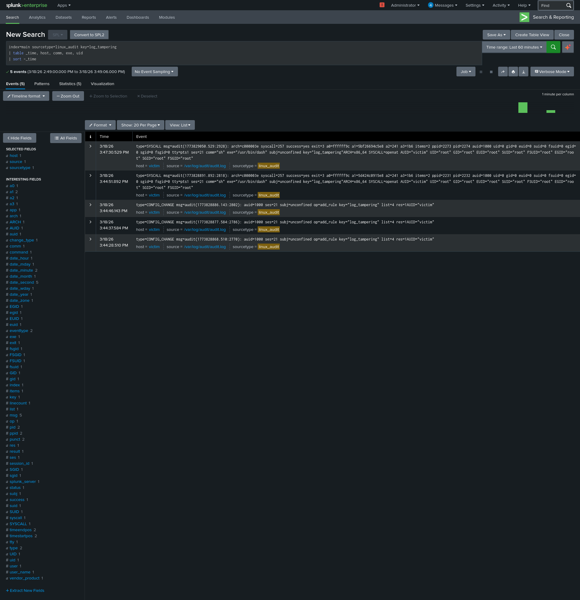

# Scenario 08: Log Tampering Detection

**Date:** 2026-03-18
**MITRE ATT&CK:** T1070.002 — Indicator Removal: Clear Linux or Mac System Logs
**Severity:** Critical

## Lab Setup
- Attacker: Kali Linux (ATTACKER_IP)
- Victim: Ubuntu Server (VICTIM_IP)
- SIEM: Splunk Enterprise (Free)

## Attack Executed
```bash
# Attacker clearing logs to cover tracks
sudo sh -c 'echo "" > /var/log/auth.log'
```

## Why Attackers Do This
- Remove evidence of brute force attempts
- Clear successful login records
- Hide malicious command execution
- Cover lateral movement tracks

## Auditd Rule Added
```bash
-w /var/log/auth.log -p wa -k log_tampering
-w /var/log/syslog -p wa -k log_tampering
-w /var/log/audit/audit.log -p wa -k log_tampering
```

## Detection SPL Query
```splunk
index=main sourcetype=linux_audit key=log_tampering
| table _time, host, comm, exe, uid
| sort -_time
```

## Findings
- 5 events captured when auth.log was cleared
- Auditd write watch caught the tampering attempt
- Frequency gap visible in linux_secure timechart

## Bonus Detection — Log Volume Drop
```splunk
index=main sourcetype=linux_secure
| timechart count span=1m
```

## MITRE ATT&CK Mapping
- Tactic: Defense Evasion
- Technique: T1070.002 — Clear Linux or Mac System Logs

## Screenshot


## Response Steps
1. Immediately alert — log clearing is always suspicious
2. Check what was in the log before it was cleared
3. Review auditd logs for commands run before tampering
4. Investigate all activity from same user/session
5. Check if other logs were also cleared
6. Treat as active incident — attacker likely still present
